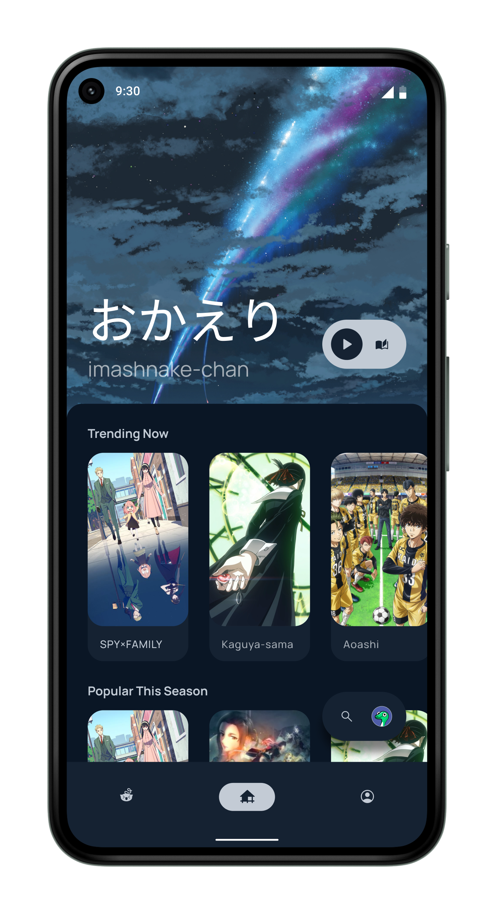

# Animite 🚧
<a href="https://www.reddit.com/r/Animite/">
    <picture>
        <source media="(prefers-color-scheme: dark)" srcset="resources/reddit-assistive-chip-dark.svg">
        
    </picture>
</a>
<a href="https://discord.gg/G8wF7pjpya">
    <picture>
        <source media="(prefers-color-scheme: dark)" srcset="resources/discord-assistive-chip-dark.svg">
        
    </picture>
</a>

[Animite](https://github.com/users/imashnake0/projects/1) is an unofficial client for [AniList](https://anilist.co/) (and potentially [MAL](https://myanimelist.net/)).

## Stack
The app tries to make use of the latest libraries and APIs:
- **Architecture:** [MVVM](https://developer.android.com/topic/architecture).
- **Networking:** [Apollo Kotlin](https://github.com/apollographql/apollo-kotlin), [Kotlin Coroutines](https://github.com/Kotlin/kotlinx.coroutines), and [COIL](https://coil-kt.github.io/coil/).
- **UI/UX:** Made purely with [Jetpack Compose](https://developer.android.com/jetpack/compose); assets using [Figma](https://www.figma.com/).
- **Dependency Injection:** [Hilt](https://developer.android.com/training/dependency-injection/hilt-android).
- **Gradle:** [Version catalogs](https://docs.gradle.org/current/userguide/platforms.html) and [refreshVersions](https://github.com/jmfayard/refreshVersions).

### Architecture
At the moment, the app uses [Google's choice for app architecture](https://developer.android.com/topic/architecture), MVVM, since I don't know any better. The app has the following structure:
<details>
    <summary> 
        <b> <code> tree </code> </b> 
    </summary>
    <p>
        <pre>
            <code>
                animite
                ├── AnimiteApplication.kt
                ├── data
                │   ├── repos
                │   │   ├── MediaListRepository.kt
                │   │   ├── MediaRepository.kt
                │   │   └── SearchRepository.kt
                │   └── sauce
                │       ├── apis
                │       │   ├── apollo
                │       │   │   ├── Apollo.kt
                │       │   │   ├── ApolloMediaApi.kt
                │       │   │   ├── ApolloMediaListApi.kt
                │       │   │   └── ApolloSearchApi.kt
                │       │   ├── MediaApi.kt
                │       │   ├── MediaListApi.kt
                │       │   └── SearchApi.kt
                │       ├── MediaListNetworkSource.kt
                │       ├── MediaNetworkSource.kt
                │       └── SearchNetworkSource.kt
                ├── dev
                │   ├── extensions
                │   └── internal
                │       ├── Constants.kt
                │       └── Path.kt
                ├── di
                │   └── NetworkModule.kt
                └── ui
                    ├── MainActivity.kt
                    ├── elements
                    │   ├── home
                    │   │   ├── Home.kt
                    │   │   ├── MediaSmall.kt
                    │   │   ├── MediaSmallRow.kt
                    │   │   └── SearchBar.kt
                    │   ├── profile
                    │   │   └── Profile.kt
                    │   └── rslash
                    │       └── RSlash.kt
                    ├── state
                    │   ├── HomeUiState.kt
                    │   ├── HomeViewModel.kt
                    │   ├── SearchUiState.kt
                    │   └── SearchViewModel.kt
                    └── theme
                        ├── Color.kt
                        ├── Shape.kt
                        ├── Theme.kt
                        └── Type.kt
            </code>
        </pre>
    </p>
</details>

## [License](https://github.com/imashnake0/Animite/blob/15eaac4a80c1e6eef3a4d6c861cab05670fb174b/LICENSE.txt)
```
Copyright 2022 Kamalesh Reddy Paluru

Licensed under the Apache License, Version 2.0 (the "License");
you may not use this file except in compliance with the License.
You may obtain a copy of the License at

    http://www.apache.org/licenses/LICENSE-2.0

Unless required by applicable law or agreed to in writing, software
distributed under the License is distributed on an "AS IS" BASIS,
WITHOUT WARRANTIES OR CONDITIONS OF ANY KIND, either express or implied.
See the License for the specific language governing permissions and
limitations under the License.
```
